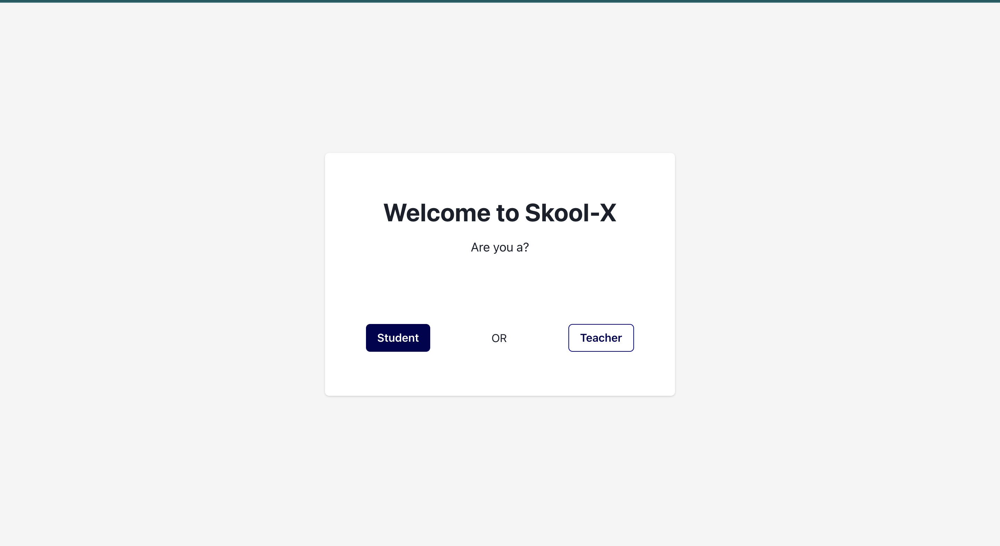

This is the Skool-X app, for uploading both teacher and student details and also view the list uploaded to the App.

## Getting Started

- First, head over to the github url to clone the project: [https://github.com/AdedejiAdelanwa/skool-x](https://github.com/AdedejiAdelanwa/skool-x).

- Clone the repo  
- Open project on your prefered text editor (PS: my fav is VS Code).
- Open a terminal in the text editor and run the command below to install the dependencies for the project

```bash
 npm i
```

- Get the app running by running any of  the command below:


```bash
npm run dev
# or
yarn dev
# or
pnpm dev
# or
bun dev
```

Open [http://localhost:3000](http://localhost:3000) with your browser to see the result.


The home page is located at localhost:3000/. 
See Below images for User flow




## More Info
- The app is built using NextJs
- Chakra Ui
- Tailwind CSS
- And some other awesome tools
